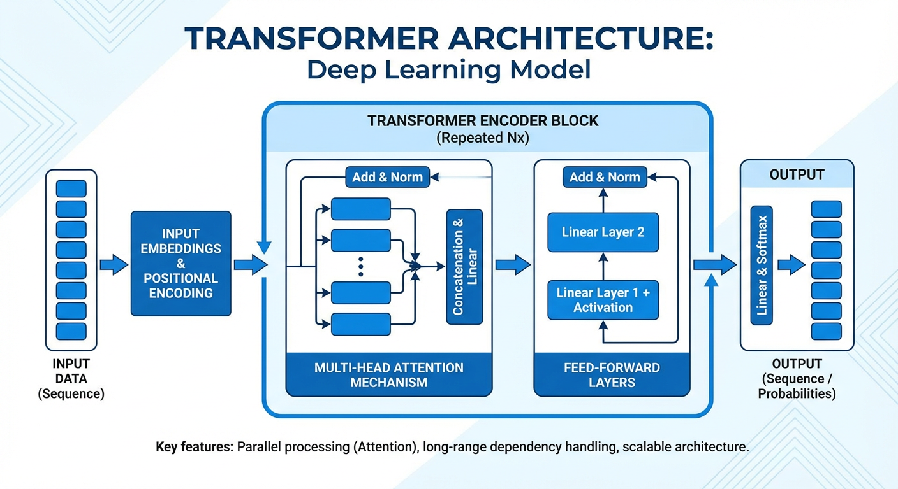
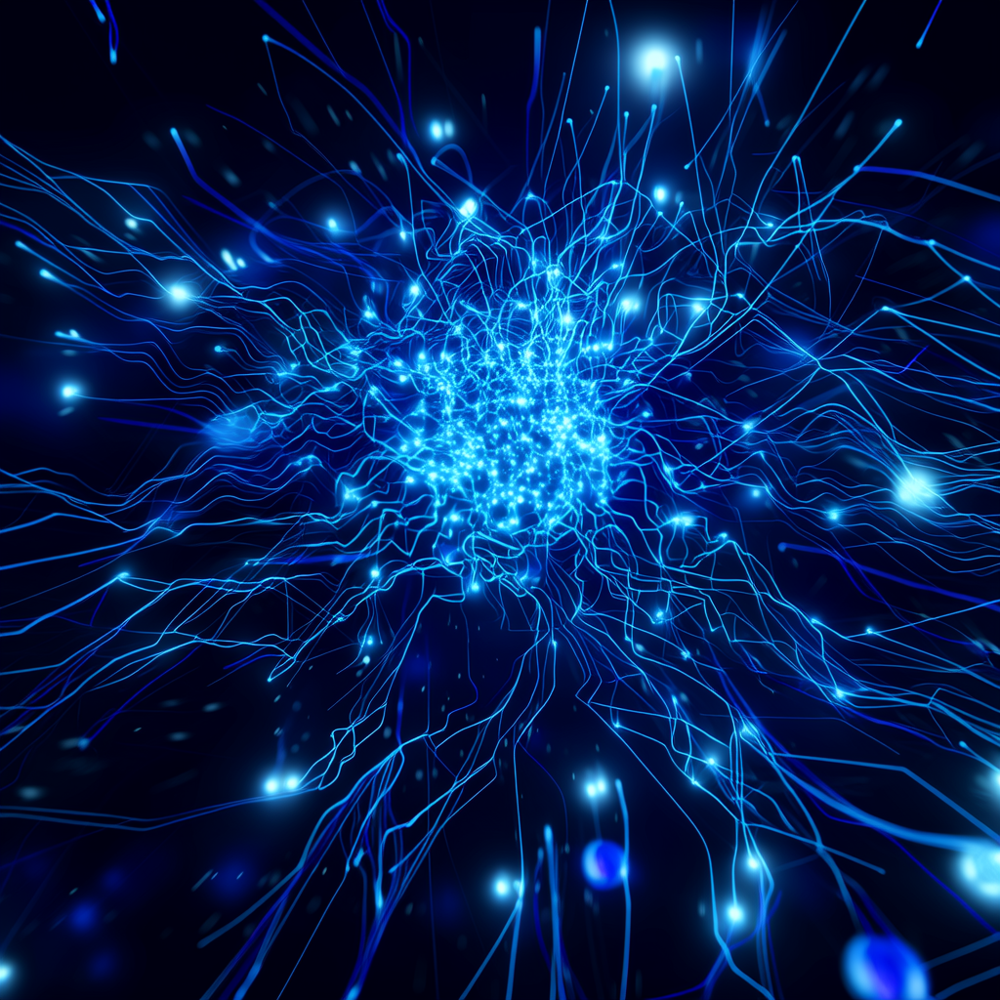

# 注意力就是你所需要的一切

**原文**: Attention Is All You Need
**作者**: Ashish Vaswani, Noam Shazeer, Niki Parmar, Jakob Uszkoreit, Llion Jones, Aidan N. Gomez, Łukasz Kaiser, Illia Polosukhin (Google Brain / Google Research / University of Toronto)
**我的解读时间**: 2024年

---

## 开场: 为什么要读这篇论文

说实话，如果你今天还在用AI聊天、写作、翻译，或者听说过GPT、BERT这些名字，那你其实每天都在享受这篇论文的成果——只是你可能不知道而已。

2017年，Google的八位研究者发表了这篇论文，标题简单到有点狂妄："注意力就是你所需要的一切"。他们提出了一个叫做"Transformer"的新架构，彻底改变了整个AI领域的走向。今天我们熟知的ChatGPT中的"T"，指的就是Transformer。

我第一次读这篇论文的时候，其实有点懵：这帮人到底在搞什么？为什么要把之前用得好好的循环神经网络扔掉？但当我真正理解了他们的思路之后，不得不感叹：这确实是一次教科书级别的"范式革命"。

---

## 研究背景: 他们想解决什么问题

### 2017年的AI世界长什么样？

在Transformer出现之前，如果你想让机器翻译一段文字，或者让AI理解一篇文章，主流的做法是用一种叫做"循环神经网络"（RNN）的东西，特别是它的升级版——LSTM（长短期记忆网络）。

这玩意儿的工作原理是什么呢？想象你在读一本书，你是一个字一个字读的，而且你得记住前面读过的内容才能理解后面的句子。RNN就是这么干的：它一个词一个词地处理句子，每处理一个新词，就把之前的"记忆"传递下去。

听起来挺合理的对吧？但问题来了。

### 第一个大问题：慢，太慢了

因为RNN必须"一个接一个"地处理，所以你没法并行计算。如果一个句子有100个词，你就得老老实实算100步。这在当时的GPU时代是个灾难——GPU最擅长的就是同时算一大堆东西，但RNN偏偏不让它发挥特长。

训练一个好的翻译模型，动辄要几周甚至几个月。

### 第二个大问题：健忘症

虽然理论上RNN能"记住"之前的内容，但实际上它有严重的"健忘症"。当句子很长的时候，开头的信息传到结尾，早就被"稀释"得差不多了。

比如这个句子："The cat, which had been sleeping on the couch for hours while its owner was cooking dinner in the kitchen, finally woke up."（那只猫——它在沙发上睡了好几个小时，而它的主人一直在厨房做饭——终于醒了。）

RNN处理到"woke up"的时候，可能早就"忘了"主语是"cat"。

### 注意力机制：一个聪明的补丁

为了解决这个问题，研究者们发明了"注意力机制"。简单来说，就是在翻译某个词的时候，让模型能够"回头看"原文中所有相关的词，而不是只依赖那条细细的"记忆链"。

这个想法确实管用，翻译质量大幅提升。但问题是，大家都把注意力机制当成RNN的"配菜"——RNN还是主角，注意力只是个辅助。

然后Google的这帮人就问了一个颠覆性的问题：**如果注意力这么好用，我们干嘛还需要RNN？能不能只用注意力？**

---

## 他们是怎么做的: 方法论解读

### 核心思想：让所有词同时"对话"

Transformer的核心思想，用一句大白话说就是：**与其让词语们排队依次传话，不如让它们直接开一个"全体会议"，谁跟谁相关，直接当面聊。**

这就是所谓的"自注意力"（Self-Attention）机制。

### 自注意力是怎么工作的？

想象你在翻译一个句子，比如"The animal didn't cross the street because it was too tired."（那个动物没有过马路，因为它太累了。）

这里的"it"指的是什么？是"animal"还是"street"？人类一眼就能看出是"animal"，但机器怎么知道呢？

在自注意力机制中，每个词都会产生三个向量：
- **Query（查询）**：我在找什么信息？
- **Key（键）**：我能提供什么信息？
- **Value（值）**：我的具体内容是什么？

当处理"it"这个词的时候，模型会拿着"it"的Query，去跟句子中所有词的Key做比较，算出相关性分数。然后根据这些分数，加权组合所有词的Value，得到"it"的新表示。

如果"animal"的Key跟"it"的Query很匹配，那"animal"的信息就会被大量引入到"it"的表示中。这样模型就"理解"了"it"指的是"animal"。

### 缩放点积注意力：一个小而精妙的技巧

具体计算的时候，他们用的是点积（两个向量对应位置相乘再求和）来衡量Query和Key的相似度。但有个问题：当向量维度很大的时候，点积的结果可能变得很大，导致softmax函数的梯度变得很小，训练困难。

怎么办？除以一个数——具体是√dk（dk是向量维度）。这个看似简单的操作，背后有严谨的数学考量：当Query和Key的各个分量是独立的、均值为0、方差为1的随机变量时，它们点积的方差正好是dk。除以√dk就把方差拉回到1，稳定了训练。

### 多头注意力：同时从多个角度看问题

一个注意力头可能只关注某一种语义关系，比如"主谓关系"。但语言是复杂的，一个词可能同时跟多个词有不同的关系。

解决方案是"多头注意力"：不只做一次注意力，而是同时做8次（论文中用的是8个头），每次用不同的参数投影。就像开会的时候，同时成立8个专题小组，每个小组关注不同的话题，最后再把各组的结论汇总。

### 编码器-解码器结构

整个Transformer由编码器和解码器两部分组成：

**编码器**（6层堆叠）：
- 每层有两个子模块：多头自注意力 + 前馈神经网络
- 每个子模块都有残差连接和层归一化
- 所有位置可以同时计算，完全并行！

**解码器**（也是6层堆叠）：
- 比编码器多一个子模块：跟编码器输出做交叉注意力
- 自注意力有"掩码"——只能看到之前生成的词，不能偷看后面的
- 这确保了生成过程的自回归性质

### 位置编码：告诉模型词的顺序

因为自注意力是"并行"的，它本身不知道词的顺序。"我吃了苹果"和"苹果吃了我"对它来说可能一样。

解决方案是加入"位置编码"——用正弦和余弦函数生成的向量，直接加到词向量上。不同位置的编码是不同的，模型就能学会区分顺序了。

为什么用三角函数？因为对于任何固定的距离k，位置pos+k的编码可以表示为位置pos的编码的线性变换。这意味着模型可以很容易地学会关注"相对位置"。

---

## 核心发现: 他们发现了什么

### 发现一：翻译质量大幅提升，刷新纪录

在WMT 2014英德翻译任务上，Transformer达到了28.4的BLEU分数，比之前的最好成绩（包括模型集成）高出2分以上。这在机器翻译领域是一个巨大的跨越。

在英法翻译上，单模型达到41.8的BLEU分数，创下新的单模型纪录。

### 发现二：训练速度快得惊人

这可能是比翻译质量更重要的发现。

基础版Transformer只需要在8块P100 GPU上训练12小时就能达到很好的效果。大模型训练3.5天就创造了新纪录。

而之前的最好模型，训练成本动辄是Transformer的几十倍甚至上百倍。

为什么这么快？因为可以并行。RNN处理一个100词的句子需要100步，Transformer只需要一步（当然每步的计算量更大，但GPU最擅长的就是这种大批量并行计算）。

### 发现三：能迁移到其他任务

为了验证Transformer不只是"翻译专用"，他们把它用在了英语句法分析任务上。

结果令人惊讶：即使没有针对任务做特别优化，Transformer的表现也超过了大多数专门设计的模型。在半监督设置下，达到了92.7的F1分数。

这说明Transformer学到的是更通用的语言理解能力，而不只是翻译技巧。

### 发现四：注意力可视化揭示了语言理解

论文附录中展示了注意力权重的可视化，非常有趣：

- 某些注意力头专门捕捉长距离依赖，比如把"making"和"more difficult"联系起来
- 某些头专门做指代消解，能准确地把"its"指向"The Law"
- 不同的头似乎自动学会了不同的任务，有的关注句法结构，有的关注语义关系

这意味着Transformer不只是一个黑箱，它的内部运作在某种程度上是可解释的。

### 发现五：更多的头和更大的模型确实有帮助，但有上限

他们做了大量消融实验：
- 单头注意力比8头差0.9 BLEU
- 但头数太多（如32头）也会掉分
- 减小注意力键的维度会伤害性能
- Dropout正则化很重要
- 使用学习的位置编码和正弦位置编码效果差不多

---

## 深入思考: 这意味着什么

### 这是一次范式转换

在Transformer之前，序列建模的范式是"时间步循环"——信息像水流一样一步步传递。Transformer彻底打破了这个范式，提出了"全局注意"——所有位置直接交互。

这不只是技术改进，而是思想的转变。

### 并行化是深度学习的核心竞争力

这篇论文让我深刻意识到：在深度学习时代，一个算法能不能并行化，可能比它理论上有多优雅更重要。

GPU的算力在指数增长，但这些算力能不能被利用，取决于算法设计。Transformer完美地适配了现代硬件，这是它成功的关键原因之一。

### 通用架构的胜利

Transformer证明了一个足够强大的通用架构，可以在不同任务上都表现很好。这启发了后来的"预训练+微调"范式——先在大量数据上训练一个通用模型，再针对具体任务微调。

GPT、BERT、T5等模型，都是这个思想的延续。

### 注意力的可解释性带来新的研究方向

注意力权重可以可视化，这给了研究者一个"窗口"去理解模型在"想"什么。这催生了大量关于Transformer可解释性的研究。

---

## 局限与展望

### 当时论文就承认的局限

1. **二次复杂度问题**：自注意力的计算复杂度是O(n²)，n是序列长度。这意味着处理长文本（比如一整本书）会非常慢且耗内存。

2. **位置编码的限制**：虽然作者声称正弦位置编码能"外推"到更长的序列，但后来的研究发现这个泛化能力其实很有限。

3. **自回归生成的速度**：解码器每次只能生成一个token，无法并行，所以生成长文本还是慢。

### 后来被发现的问题

1. **过度参数化**：Transformer需要大量参数才能表现好，这带来了训练和部署的成本问题。

2. **对数据量的依赖**：Transformer在小数据集上容易过拟合，需要大量数据才能发挥优势。

3. **缺乏归纳偏置**：RNN天然有"顺序"的归纳偏置，CNN有"局部性"的归纳偏置，Transformer几乎没有，所以需要更多数据来学习这些结构。

### 后续发展

这篇论文发表后，Transformer迅速统治了NLP领域：
- 2018年：BERT用Transformer编码器实现了预训练语言模型
- 2018-2023：GPT系列用Transformer解码器实现了生成式AI
- 2020年：ViT把Transformer引入了计算机视觉
- 如今：几乎所有主流AI模型都基于Transformer

---

## 我的感想

读完这篇论文，我最大的感受是：**伟大的创新往往不是从零开始，而是对现有技术的重新组合和极端化推进。**

注意力机制不是他们发明的，编码器-解码器结构也不是，残差连接、层归一化更不是。但他们敢于问一个简单的问题："如果只用注意力会怎样？"然后把这个想法推到极致。

这需要的不只是技术能力，更是一种"敢于怀疑主流"的勇气。当时RNN是公认的序列建模标准，LSTM更是被视为近乎完美的解决方案。敢于说"不需要RNN"是需要底气的。

另一个让我印象深刻的是团队协作的力量。论文脚注详细列出了每个人的贡献——Jakob提出用自注意力替代RNN的想法并开始评估，Ashish和Illia设计实现了第一个模型，Noam提出了缩放点积注意力和多头注意力……这是一个真正的team effort。

最后，我想说：这篇论文的标题虽然狂妄（"注意力就是你所需要的一切"），但某种程度上，它确实说对了。在Transformer之后的AI世界，注意力机制确实变成了几乎所有重要模型的核心组件。

有时候，最好的论文标题就是一句大实话。

---

## 总结

Google的八位研究者在2017年提出了Transformer架构，彻底摒弃了当时主流的循环神经网络，完全基于注意力机制来处理序列。这个设计不仅在翻译任务上刷新了记录，更重要的是实现了完全的并行化，大幅加速了训练过程。Transformer后来成为了GPT、BERT等划时代模型的基础，彻底改变了人工智能的发展轨迹。这篇论文告诉我们：有时候，最激进的简化反而是最强大的创新。

---

**元数据**
📄 论文类型: 深度学习架构 / 自然语言处理
⏱️ 发表时间: NIPS 2017
🏆 影响力: 被引用超过10万次，现代AI基础架构
🔗 代码: https://github.com/tensorflow/tensor2tensor

---

## 配图

---

**元数据**
📄 论文文件: `papers/downloaded_paper.pdf`
⏱️ 处理时长: 97.8秒
🖼️ 配图生成: 成功 (2张)
🤖 生成模型: claude-opus-4-5-20251101 (via Claude Agent SDK)
📅 生成时间: 2026年01月17日 12:53:32

---

*本解读由 GitHub Actions + Claude Agent SDK + 通义万相 自动生成*
